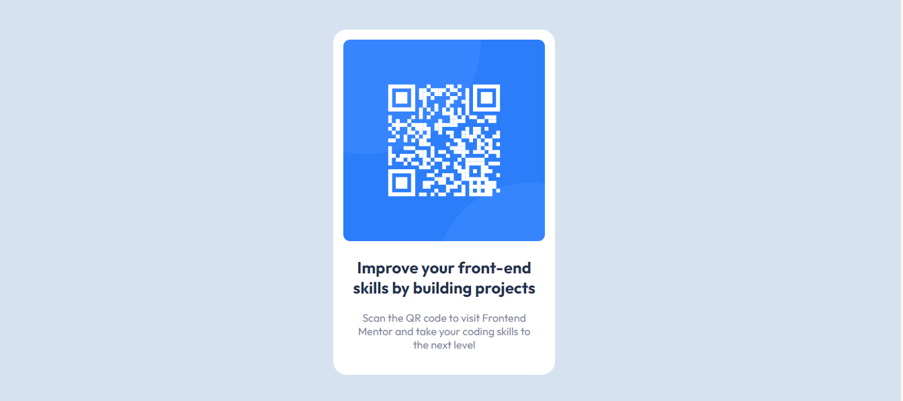

# Frontend Mentor - QR code component solution

This is a solution to the [QR code component challenge on Frontend Mentor](https://www.frontendmentor.io/challenges/qr-code-component-iux_sIO_H). Frontend Mentor challenges help you improve your coding skills by building realistic projects. 

## Table of contents

- [Overview](#overview)
  - [Screenshot](#screenshot)
  - [Links](#links)
- [My process](#my-process)
  - [Built with](#built-with)
  - [Continued development](#continued-development)
- [Author](#author)

## Overview

### Screenshot

### Links

- Solution URL: [Click for Source](https://www.frontendmentor.io/solutions/solution-of-qr-code-component-project-SPDqhIGv4j)
- Live Site URL: [Click for live site](https://www.jatinrai000-githubpages.infinityfreeapp.com/)

### My Process

### Built with

- Semantic HTML5 markup
- CSS custom properties
- Flexbox

### Continued development

I plan to focus on CSS in future projects, as I feel that my current understanding and proficiency in CSS are areas that I'd like to strengthen and improve.

## Author

- Website - [Jatin Rai](https://www.frontendmentor.io/profile/webycoderjatin)
- Frontend Mentor - [@webycoderjatin](https://www.frontendmentor.io/profile/webycoderjatin)

